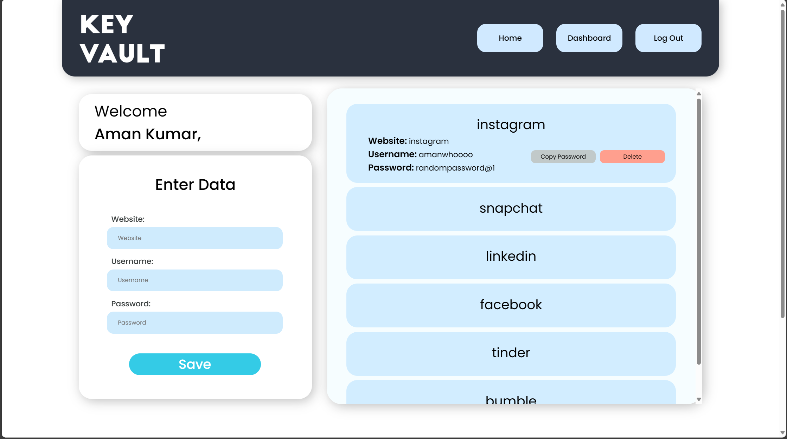

# KeyVault - Password Manager

KeyVault is a secure and intuitive password manager application designed to help users manage their passwords and sensitive information effectively. It provides a seamless user experience with features like secure storage, local storage persistence, and a user-friendly interface for adding, viewing, and copying passwords.

---

## Description

KeyVault offers a secure and convenient solution for managing passwords and sensitive information. With an intuitive interface and robust security measures, users can trust KeyVault to keep their data safe and easily accessible.

---

## Features

- **Secure Storage**: Store passwords and sensitive information securely.
- **User-Friendly Interface**: Intuitive UI for adding, viewing, and copying passwords.
- **Local Storage Persistence**: Persist user entries across sessions using local storage.
- **Entry Expansion**: View additional details of entries such as username and password.
- **Password Copying**: Copy passwords to the clipboard with a click of a button.

---

## Technologies Used

- **Frontend**:
  - React.js
  - React Router DOM
  - react-simple-typewriter (for typewriter effect)

- **Backend**:
  - Node.js
  - Express.js
  - auth0 (for authenticating user credentials for signing in)
  - MongoDB (for storing user credentials)
- **Styling**:
  - CSS

---

## Installation

1. Clone the repository:
- git clone https://github.com/trulyaman25/keyvault.git

2. Navigate to the project directory:
3. Install dependencies:
4. Set up MongoDB:
- Create a MongoDB Atlas account and set up a cluster.
- Update the MongoDB connection string in `app.js`.

5. Start the development server:
6. Open your browser and navigate to `http://localhost:5173` to access the application.

---

## Usage

1. **Sign Up**:
- Create a new account by providing your fullname, username, email, and password.

2. **Sign In**:
- Log in to your account with your username and password.

3. **Dashboard**:
- Add, view, and manage your passwords and other sensitive information in the dashboard.

4. **Security Note**:
- Ensure that no sensitive information is shared or stored in insecure environments.

---

## Improvements

- **Enhanced Security Features**: Implement additional security measures such as encryption for storing passwords.
- **User Authentication**: Integrate user authentication to enhance account security.
- **Improved UX/UI**: Enhance user experience with a more intuitive and visually appealing interface.
- **Cross-Device Sync**: Enable synchronization of passwords across multiple devices for user convenience.

---

## Future Goals

- **Multi-Language Support**: Add support for multiple languages to cater to a wider user base.
- **Mobile Application**: Develop a mobile app version of KeyVault for seamless access on mobile devices.
- **Password Generator**: Incorporate a password generator feature to help users create strong and unique passwords.
- **Browser Extensions**: Create browser extensions for popular browsers to facilitate password autofill and management.

---

## Images

---
